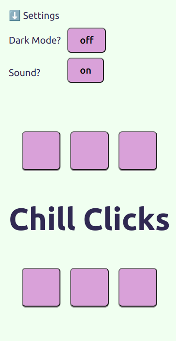

# Chill Clicks - Sensory Game App

Welcome to Chill Clicks, a colour and auditory stimming (self-stimulating) app. Click the button tiles and see/hear what happens.

Sound Effects by <a href="https://pixabay.com/users/universfield-28281460/?utm_source=link-attribution&utm_medium=referral&utm_campaign=music&utm_content=131917">UNIVERSFIELD</a> from <a href="https://pixabay.com/sound-effects//?utm_source=link-attribution&utm_medium=referral&utm_campaign=music&utm_content=131917">Pixabay</a>

## Note from the creator

As a neurodivergent person, I find patterns can be very grounding. This app is my, simplified, take on sensory apps that allows the user to engage with repetitive sounds and patterns.

This is an area of passion for me and there will be ongoing features added. For now, this project is a way for me to express myself, my passion for accessibility and coding skills.

Technologies and Skills used:

React Framework (Hooks)
Typescript
HTML5
CSS Modules

Jest - unit and integration testing 
React Testing

Excalidraw - wireframes &
Kanban (Trello) - track tasks

## Wireframe

## Screenshot

## Future Features

- alternative sounds to cycle through
- moving buttons

## How To Copy This Repo

1. In gitHub, Fork this repo.
2. Copy the HTTPS URL from '<> Code'
3. Go to your terminal (Ctrl+Alt+T on Ubuntu)
4. Navigate to the folder or choice
5. 'git clone URL'
6. open folder, install dependencies ('npm i') then npm run dev
7. Click the Local link returned in terminal, this will open in your browser!
8. **To run tests: ** npm run test (will run both Unit and Integration tests, found in __ tests __ folder)
