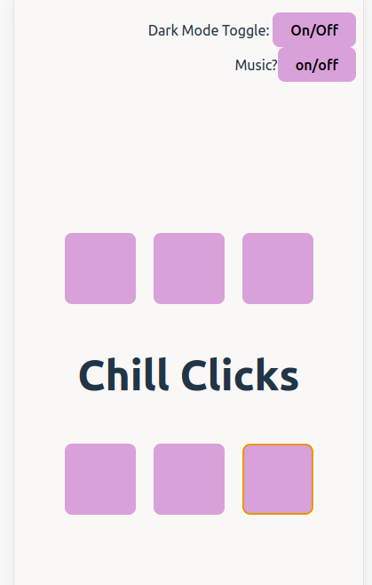

# Sensory Game App

05/06/2023 - Work In Progress
Sound Effects by <a href="https://pixabay.com/users/universfield-28281460/?utm_source=link-attribution&utm_medium=referral&utm_campaign=music&utm_content=131917">UNIVERSFIELD</a> from <a href="https://pixabay.com/sound-effects//?utm_source=link-attribution&utm_medium=referral&utm_campaign=music&utm_content=131917">Pixabay</a>

## Note from the creator

As a neurodivergent person, I find patterns can be very grounding and help me to self-stimulate (aka stim). This app is my, simplified, take on sensory apps that allows the user to engage with calming colours and music.

This is an area of passion for me and there will be ongoing features added. For now, this project is a way for me to express myself, my love for accessibility as well as my passion for tech.

Made using Vite build tool
React Framework
Typescript
HTML5
CSS3

## Wireframe

## Screenshot (as of 08/06 - WIP!)

## How To Copy This Repo

1. In gitHub, Fork this repo.
2. Copy the HTTPS URL from '<> Code'
3. Go to your terminal (Ctrl+Alt+T on Ubuntu)
4. Navigate to the folder or choice
5. 'git clone URL'
6. open folder, install dependencies ('npm i') then npm run dev
7. Click the Local link returned in terminal, this will open in your browser!
